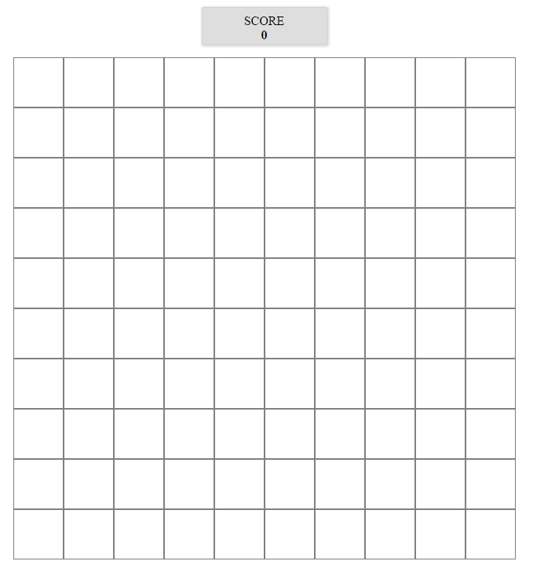
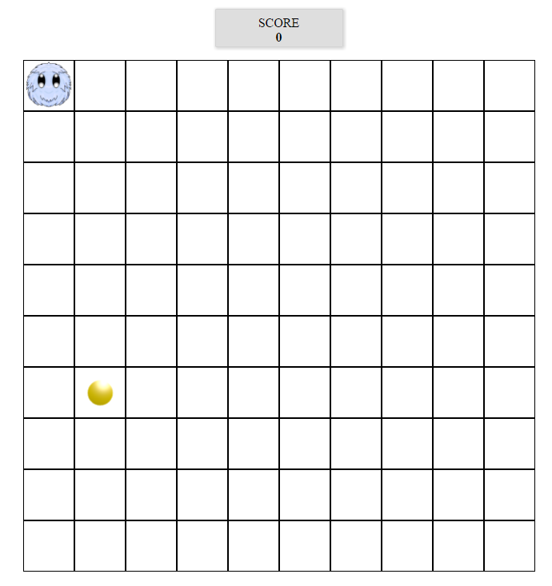

# Furry Game

## Przygotowanie

> Pamiętaj o:
> - ```npm init```
> - Zainstalowaniu Webpacka.
> - Ustawieniu Webpacka, plikiem wejściowym ma być `js/app.js`, wyjściowym `js/out.js`


## Na czym polega warsztat?

### Gra "Furry zbiera monety"

Celem tego ćwiczenia jest napisanie prostej gry w Javascript. W trakcie pracy nad tym zadaniem poznasz technikę
programowania obiektowego i dowiesz się, dlaczego używanie obiektów, ich metod i właściwości ma sens. :-)

Bohaterem naszej gry jest **Furry**, który porusza się po planszy o rozmiarach 10x10 pól.

Na losowym polu planszy znajduje się moneta. Gracz sterując Furrym przy pomocy strzałek na klawiaturze musi dojść do monety. Gdy to zrobi, moneta znika z planszy i pojawia się na innym polu, również losowym, a gracz dostaje 1 punkt.

Gdy gracz uderzy w ścianę, gra się kończy: plansza znika i, jak to w grach komputerowych bywa, pojawia się napis "GAME OVER".

W każdym momencie gry, gracz musi widzieć ile monet już zebrał.

Tutaj możesz obejrzeć przykładowe rozwiązanie: https://marcin-barylka.github.io/js-furry-solution/

## Zaczynamy!

### 1. Budowanie planszy

**Wyniki:**
* Zajrzyj do pliku `index.html`. Znajdziesz w nim sekcję o nazwie score. Sekcja ta jest już ostylowana. Będzie nam potrzebna jak sama nazwa wskazuje do pokazywania użytkownikowi punktów.

**Plansza:**
* W pliku `index.html` znajdziesz również  mnóstwo pustych elementów `<div>`. Jest ich dokładnie 100. Będą to pola kwadratowej planszy o wymiarach 10x10 pól.
* Zajrzyj do pliku `style.css`, znajdującego się w katalogu `css`. Znajdziesz tam prototyp pliku ze stylami do naszej gry. Podepnij plik CSS do dokumentu HTML.
* W pliku `index.html`, wszystkie elementy `<div>` umieść w elemencie `<section>` tak, aby jeden element `<section>` zawierał wszystkie 100 elementów `<div>`. Nadaj sekcji identyfikator `#board`.
* Nadaj elementom `<div>` znajdującym się wewnątrz elementu o identyfikatorze `#board` następujące właściwości:
    * szerokość 64px i wysokość 64 px,
    * ramkę o szerokości 1 piksela, dowolnego koloru,
    * ustaw wszystkie elementy obok siebie.
* Elementowi `#board` nadaj następujące style:
    * wysokość 640px i szerokość 640px,
    * ustaw cały element na środku ekranu i odsuń go od górnej krawędzi.

Podejrzyj plik `index.html` w przeglądarce. Jeśli wszystko zrobiłeś poprawnie, powinieneś zobaczyć kwadratową planszę o wymiarach 10x10 pól.

Plansza powinna wyglądać mniej więcej tak jak na screenie:



## 2. Przygotowanie elementów grafiki gry

Zajrzyj do katalogu `images`. Znajdziesz w nim dwa obrazki:
* `furry.png` -- bohater naszej gry,
* `coin.png` -- przedmiot pożądania naszego bohatera. ;-)

W pliku CSS utwórz dwie klasy:
* `.furry`, której nadaj następujące właściwości:
    - jako tło obrazek `furry.png`,
    - zablokuj powtarzanie tła,
    - spraw, by obrazek wypełniał całe tło.
* `.coin`, której nadaj następujące właściwości:
    - jako tło obrazek `coin.png`,
    - zablokuj powtarzanie tła,
    - spraw, by obrazek wypełniał całe tło.


## 3. Przygotowanie pliku `app.js`

* W głównym katalogu projektu utwórz katalog o nazwie `js`. Wewnątrz tego katalogu utwórz plik `app.js`.
* Do pliku HTML podłącz plik wynikowy, który będzie generował Webpack - np. `out.js`. Podepnij go na końcu strony, przed zamknięciem elementu body
* w pliku `app.js` dodaj np. `console.log('hello')`, uruchom konsolę i za pomocą Webpacka wygeneruj plik `out.js`. Pamiętasz jak uruchomić webpacka lokalnie?

```JavaScript
./node_modules/.bin/webpack app.js out.js
```
*Jeśli jesteś w głownym katalogu pamiętaj o odpowiednim poinformowaniu Webpacka gdzie jest plik app.js oraz gdzie powinien zapisać plik out.js np. js/app.js i js/out.js*

* Otwórz plik `index.html` w przeglądarce i zobacz czy w konsoli został wypisany tekst.

## 4. Przygotowanie konstruktora dla Furry'ego i monety

* Będąc w pliku `app.js` utwórz:
    * konstruktor  `Furry()`, któremu zdefiniuj następujące właściwości:
        - `x`: pozycja Furry'ego na osi X,
        - `y`: pozycja Furry'ego na osi Y,
        - `direction`: kierunek poruszania się Furry'ego (ta właściwość będzie przyjmowała cztery wartości: `left`, `right`, `up` i `down`, ale tym zajmiemy się później).

        Nasz bohater będzie startował z lewego, górnego rogu ekranu, a szedł będzie w prawo. Nadaj właściwościom `x`, `y` i `direction` początkowe wartości:

         ```JavaScript
         this.x = 0;
         this.y = 0;
         this.direction = "right";
         ```
    * konstrutor `Coin()`  któremu zdefiniuj następujące właściwości:
        - `x`: pozycja monety na osi X,
        - `y`: pozycja monety na osi Y.

        Pozycja monety po wylosowaniu nie zmienia się aż do momentu jej zebrania przez Furry'ego. Możemy zatem od razu po utworzeniu ją wylosować. Wiemy, że plansza ma rozmiar 10x10 pól (liczone od 0, do 9). Korzystając z podpowiedzi poniżej, nadaj w konstruktorze właściwościom `x` i `y` odpowiednie, losowe wartości.

        podpowiedź:
        ```javascript
        Math.floor(Math.random() * 10);
        ```

**Pamiętaj o odpowiednim użyciu słowa kluczowego `this` wewnątrz obiektów!**

## 5. Przygotowanie obiektu zarządzającego grą.

* Będąc w pliku `app.js` utwórz:

    * konstruktor   `Game()`, który będzie przechowywał egzemplarz Furry'ego, monetę, planszę gry i aktualny wynik gracza. Obiekt ten będzie również posiadał metody do zarządzania grą. Zdefiniuj mu następujące właściwości:
        - `board`: umieść w niej wszystkie pola planszy. Użyj, znanej Ci, metody łapiącej wszystkie elementy `<div>`, znajdujące się w elemencie `<section>` o identyfikatorze `#board`,
        - `furry`: ta właściwość będzie reprezentowała głównego bohatera gry. Nadaj jej wartość `new Furry()`,
        - `coin`: ta właściwość będzie przechowywała monetę. Nadaj jej wartość `new Coin()`. Zwróć uwagę, że od razu po utworzeniu nowego egzemplarza monety, jej pozycja x i y są już gotowe,
        - `score`: to będzie aktualny wynik gracza. Nadaj mu wartość 0.

## 6. Obliczanie pozycji.

Pozycja na planszy, zarówno Furry'ego, jak i monety, podawana jest przy użyciu właściwości x i y. Lista pól planszy jest trzymana w tablicy jednowymiarowej. Jej indeksy mieszczą się w przedziale (0, 99). Jak zatem pogodzić te dwa, różne sposoby zapisu pozycji?

W pliku `app.js` do konstruktora `Game()` dodaj metodę, która przeliczy pozycję x i y na indeks tablicy wg. odpowiedniego wzoru.

podpowiedź:
```javascript
this.index = function(x,y) {
  return x + (y * 10);
}
```

## 7. Rysowanie stanu planszy.

Skoro mamy już zdefiniowane elementy gry (Furry i moneta) i umieściliśmy je w grze (właściwości `furry` i `coin` w obieckie `Game()`), powinniśmy zaprogramować pokazanie ich na odpowiednich polach planszy.

Aby pokazać Furry'ego, wystarczy elementowi `<div>` planszy, odpowiadającemu pozycji x i y Furry'ego, nadać klasę `.furry`. Podobnie należy zrobić z monetą.

* Napisz metodę w konstruktorze `Game()` - `showFurry()`, która to zrobi. Wykorzystaj metodę przeliczającą pozycję, którą napisałeś w poprzednim punkcie.

    podpowiedź:
    ```javascript
     this.board[ this.index(this.furry.x,this.furry.y) ].classList.add('furry');
    ```

* Napisz metodę w konstruktorze `Game()` - `showCoin()`, która pokaże monetę. Metoda ta powinna działać w analogiczny sposób jak `showFurry()`

* Stwórz obiekt gry i wywołaj metodę `showFurry()` i `showCoin()`. Oczywiście poza konstruktorem `Game()`.

Po przetworzeniu kodu przez Webpack i otworzeniu pliku `index.html` w przeglądarce powinna się pojawić następujące scena (pamiętaj, że moneta może być w innym punkcie - jej pozycja jest losowana)



## 8. Start

Zauważyłeś na pewno na demo gry, że jeżeli nie sterujesz furrym to on i tak sam przesuwa się w zadanym kierunku. Wykorzystamy do tego `setInterval()`. W pliku `app.js` wywołaj metodę `startGame()` na obiekcie Game.

Do konstruktora Game() dodaj następnie metodę `startGame()`. Zapisz zwracany przez nią id pod this.idSetInterval, tak, aby można go było usunąć na końcu gry. Drugi parametr funkcji setInterval ustaw na 250 ms. Niech funkcja na początek wypisuje zwykły tekst w console.log("hura z setIntervala"). Przetestuj czy wpisany przez Ciebie tekst jest wywoływany odpowiednio w konsoli.

## 9. Modyfikacja pozycji Furry'ego zależnie od kierunku.

Ustawiliśmy funckję setInterval po to, by przesuwać Furriego automatycznie. Zróbmy to zatem.

Do tej pory, przy definiowaniu Furry'ego, ustaliliśmy, że na początku będzie poruszał się w prawo, rozpoczynając od lewego, górnego rogu planszy. Niemniej, celem gry jest zmuszenie Furry'ego, aby chodził w różne strony.

Musimy zatem zmodyfikować pozycję x i y Furry'ego, w zależności od kierunku, w którym się porusza. Zwróć uwagę na właściwość `direction`, którą już definiowaliśmy w jego konstruktorze. Możemy zatem napisać metodę, która odpowiednio zmodyfikuje właściwości `x` i `y` na podstawie wartości właściwości `direction`.
W konstruktorze Game dopisz zatem metodę `moveFurry()`. Wywołuj ją w funkcji `setInterval()` - (tam gdzie mamy teraz console.log("hura z setIntervala") <= możesz go już usunąć )

**UWAGA:**
*O ile dotychczas używaliśmy właściwości i metod obiektu `Game()` i odnosiliśmy się do nich używając słowa kluczowego `this`, w tym przypadku nie możemy tego zrobić: wewnątrz eventu słowo kluczowe `this` wskazuje na event, nie na obiekt. Aby to ominąć przed deklaracją eventu stwórz zmienną, o nazwie, np. `self`, przypisz do niej wartość `this`, a potem wewnątrz metody obsługującej klawiaturę używaj `self`.*

W metodzie  `moveFurry()` będziemy przesuwać furriego. Napisz instrukcję `if`, w której sprawdzaj jaką wartość ma własność direction obiektu Furry. Na przykład:

podpowiedź:
```javascript
 if(this.furry.direction === "right") {
     this.furry.x = this.furry.x + 1;
 } else if ( twoje warunki )
```

Zastanów się jak modyfikować i którą wartość pozycji w przypadku kiedy furry będzie miał ustawioną własność direction na left, down lub bottom.
Przed zakończeniem funkcji wywołaj również metodę `showFurry()`.

Na razie nie przejmuj się tym, że Furry może wyjść poza planszę. Zajmiemy się tym nieco później.
Ale co jeszcze nie ciekawego po uruchomieniu kodu w przeglądarce? **Klony furriego!!!.**

Wyjaśnienie tego efektu jest bardzo proste:

* Furry ma pozycję (0, 0), rysujemy Furry'ego na tej pozycji,
* Zmieniamy pozycję Furry'ego na (1, 0), rysujemy Furry'ego na nowej pozycji,
* **ZONK!** Okazuje się, że na planszy mamy dwa wizerunki bohatera, na pozycjach (0, 0) i  (1, 0),
* Należy zatem usunąć wizerunek Furry'ego z poprzedniej pozycji.

## 9. Czyszczenie widoku - usuwanie nie potrzebnych klas.

Aby wyczyścić planszę (starą pozycję furriego), stwórzmy nową metodę w konstruktorze Game - `hideVisibleFurry()`. W funkcji znajdż element `div`, który posiadaja klasę `furry` i usuń mu tą klasę. Metodę tą wywołaj na samym początku w metodzie `showFurry()`. Pamiętaj, aby szukać jednego elementu (zawsze będzie to jeden  - poprzedni) - użyj `document.querySelector('.furry')`.

Wygeneruj plik `out.js` i sprawdź wynik w przeglądarce.

## 10. Obsługa klawiatury.

Gra powinna reagować na klawisze strzałek kursora. Musimy zatem napisać metodę w konstruktorze `Game()`, która przyjmie jako parametr zmienną o nazwie `event`. Tej metody użyjemy, jako callbacka, do zdarzenia `keydown`.

Aby pobrać kod wciśniętego klawisza, musimy użyć właściwości `which` obiektu `event`, który jest przekazywany w parametrze.

Aby oszczędzić Wam żmudnego szukania odpowiednich wartości dla klawiszy strzałek, podajemy ich kody:

* **37**: lewo,
* **38**: prawo,
* **39**: góra,
* **40**: dół.

Zmodyfikuj kierunek poruszania się Furry'ego, zależnie od wciśniętego klawisza. Użyj do tego właściwości `direction` w obiekcie `Furry()`, której nadaj odpowiednią wartość: `"up"`, `"down"`, `"left"`, `"right"`.

podpowiedzi:
Ustaw obserwację eventu keydown w pliku `app.js`.
```javascript
document.addEventListener('keydown', function(event){
    Game.turnFurry(event);
});
```

Przykład zmiany kierunku:
```Javascript
switch (event.which) {
  case 37:
    this.furry.direction = 'left';
    break;
  case 38: (....) //dopisz resztę.
```

## 11. Sprawdzanie kolizji z monetą.

W języku twórców gier, kolizja między dwoma elementami następuje wtedy, gdy elementy te na ekranie nachodzą na siebie. W naszej grze kolizja nastąpi wtedy, gdy pozycja Furry'ego będzie taka sama, jak pozycja monety.

Napisz metodę, która sprawdzi pozycję obu elementów. Jeśli kolizja nastąpi, musisz:

* usunąć monetę z ekranu (nie z obiektu gry),
* dodać 1 do wyniku,
* pamiętać o pokazaniu wyniku na ekranie,
* utworzyć nową monetę (dzięki temu, że zadbaliśmy o to przy pisaniu konstruktora, nowa moneta będzie miała losowo wybraną pozycję X i Y).

**Pamiętaj o tym, że moneta, to tak naprawdę właściwość `coin` w obiekcie `Game()`.*

W konstruktorze `Game()` stwórz zatem metodę - `checkCoinCollision()`. Wywołaj ją na samym końcu metody `moveFurry()`. To znaczy, że będziemy po każdy kroku sprawdzać czy nie ma kolizji pomiędzy Furry a monetą.

Kroki w tej metodzie:
* sprawdź czy pozycja furriego jest taka sama jak monety. Musisz porównać pozycję x i y.
* Jeżeli ich pozycja jest równa to:
    - usuń klasę coin z bieżącej pozycji.
    - zwiększ score o 1 punkt
    - uaktualnij punkt na stronie w elemencie o id score.
    - stwórz nowy obiekt coin i podstaw pod this.coin
    - wywołaj metodę `showCoin()`

## 12. Sprawdzanie kolizji ze ścianą.

Gdy Furry zderzy się ze ścianą, następuje koniec gry. Kolizja ze ścianą następuje, wtedy gdy:

    * pozycja X Furry'ego jest mniejsza od zera, lub jest większa od 9,
    * pozycja Y Furry'ego jest mniejsza od zera, lub jest większa od 9.

Napisz metodę sprawdzającą kolizję ze ścianą. Niech metoda nosi nazwę `gameOver()`. Wywołaj ją w metodzie `moveFurry()`. Musimy sprawdzać w kazdym kroku czy nie wyszliśmy poza planszę.
Kroki w tej metodzie:
* sprawdź czy pozycja furriego jest taka jak w opisie wyżej (czyli czy jego pozycja x jest mniejsza od 0 itd. )
* Jeżeli na tej postawie określisz kolizje ze ścianą to:
    - usuń `setInterval()`
    - wywołaj metodę `hideVisibleFurry`

    Dodatkowo możesz w tym miejscu zaplanować jakiś komunikat o końcu gry i pokazaniu użytkownikowi zdobytych punktów.

Możliwe problemy.
Możesz napotkać tutaj problem zbyt późnego wywoływania metody gameOver(). Zastanów się, w którym miejscu w `moveFurry()` ją umieścić? A może powinna coś zwracać np. stan gry?

## 13. Struktura kodu.

Jeśli udało Ci się dojść do tego kroku, to znaczy, że Twoja gra działa. Twoja struktura powinna wyglądać tak:

```Javascript
//konstruktor Furry
var Furry = function() {
}
//konstruktor monety
var Coin = function() {
}
//konstruktor gry
var Game = function() {

    this.index = function(x,y) {
    }

    this.showFurry = function() {
    }

    this.hideVisibleFurry = function() {
    }

    this.showCoin = function() {
    }

    this.moveFurry = function() {
    }

    this.turnFurry = function(event) {
    }

    this.checkCoinCollision = function() {
    }

    this.gameOver = function() {
    }

    this.startGame = function() {
    }
}

//Uruchomienie
var game = new Game();
//wywołanie metod i eventu keydown

```

## 14. Podział na moduły

Kolejnym i ostatnim już krokiem jest podział naszej gry na moduły. Stwórz w folderze js następujące pliki:
    * coin.js
    * furry.js
    * game.js - tutaj będziemy potrzebowali konstruktora `Coin()` oraz `Furry()`
    * app.js - ten plik już masz, tutaj będziemy potrzebowali konstruktora `Game()`.

Podziel odpowiednio Twoją aplikację umieszczając w każdym z modułów odpowiedni konstruktor. Jak się domyślasz do modułu `coin.js` musisz przenieść konstruktor `Coin()`. Analogicznie zrób z innymi modułami. Pamiętaj, aby moduły były eksportowane i importowane do innych.

Pamiętasz funkcję `require()` oraz jak eksportujemy moduły?

**Repozytorium z ćwiczeniami zostanie usunięte 2 tygodnie po zakończeniu kursu. Spowoduje to też usunięcie wszystkich forków, które są zrobione z tego repozytorium.**
